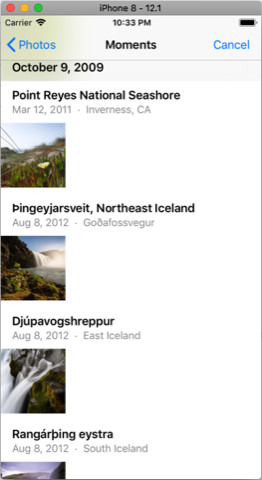

# MemeMe

- [MemeMe](#mememe)
  * [Implementation](#implementation)
    + [The application uses](#the-application-uses)
  * [Example of user flow](#example-of-user-flow)
  * [Requirements](#requirements)
  * [How to Contribute](#how-to-contribute)
  * [License](#license)
  * [Other Resources](#other-resources)
  * [To Do](#to-do)

MemeMe is the second project from the **Udacity's iOS Developer Nanodegree course** `(nd003)`.

The app allows users to create memes using pictures from Photo's Albums or using the device's camera(only real devices, not at emulator), and then write two phrases fixed at top and bottom of the selected image.

Users can share it with their friends. MemeMe also temporarily stores the sent memes that can be searched for in a table or in a grid.  

The application contains three pages of content:

- Memes editor view: Allows the user to add text to an image and share it.
- View of sent memes: Allows the user to navigate through sent memes in a table or in a grid.
- View of meme details: Displays the image of a meme sent.

Bonus:

- View of meme details: Displays the image of a meme sent and user has option to edit the current meme.
- Memes editor view: Allows the user to edit text to a existing meme and share it or save it.

## Implementation

The app has three view controller scenes:

- **UITabBarController**: Show the sent memes. It has a toolbar at the bottom with tabs that allow the user to switch between viewing memes sent in a table and in a grid. The navigation bar at the top has the heading "Memes Sent" and an add button to the right, displaying the "Add" icon native to Apple. On both views tap on meme goes to the MemeDetail Scene.
  - **SentMemesTableViewController**: Display a table with the memes.
  - **SentMemesCollectionViewController**: Display a grid with the memes.

- **MemeDetailViewController**: Displays the selected meme in an image view in the center of the page with the ratio of the original meme screen. The detail view has an arrow to go back in the upper left corner. in the upper right corner is the extra option of editing the meme.

- **MemeEditorViewController**: The memes editor view consists of an image view superimposed on two text fields, one near the top and one near the bottom of the image. This view contains a toolbar at the bottom with two buttons: one for the camera and one for the photo album. The top navigation bar has a left sharing button that displays the Apple native sharing icon and a "Cancel" button on the right.

### The application uses

- code from `UITabBarController` to navigate between table and grid views;
- code from `UIImagePickerController` to choose the source of image `camera` or `album`;
- methods `UIGraphicsBeginImageContext` and `UIGraphicsGetImageFromCurrentImageContext` to create an `UIImage`;
- code from `UIActivityViewController` to save to album or share the image generated.

## Example of user flow

App opens.

User taps  `add` `+` button.

User taps `Album` button.

Image loaded into `MemeEditorViewController` and orientation device changed to landscape.

User taps `TOP TEXT`.

User taps `BOTTOM TEXT` and the image goes up, giving focus to keyboard using `NotificationCenter Observer`.

User taps `Share button` and follow the flow of `ActivityController` to share the meme in and `Shared Albuns`.

Application ask permission for write on `Photo's Album` user's device (permission must be declared in Plist file).

Application use `UIAlertController` to notifiy user the result saving the generated image.

After create a new Meme with another image, other file is saved on the `Photo's Album`.

User taps `cancel` button to to return to the `Sent Memes` list. Default view is `Table View` mode.

User taps `grid` button to see Sent Memes in `Grid view` mode.

User taps on a Meme and goes to the `Meme Detail` view.

User taps on `edit` button, to edit a current Meme. After edit the legends of the old Meme, user taps on `share` button, and choose `Save file` option.

User taps `OK` on  `UIAlertController` and then on `cancel` button to to return to the `Sent Memes` list. Default view is `Table View` mode.

And there is the third meme using the same image on first meme with different legends.

## Requirements

- Xcode 9.2
- Swift 4.0

## How to Contribute

Find any typos? Have another resource you think should be included? Contributions are welcome!

First, fork this repository. I'll be happy to know if this example is useful for you.

Next, clone this repository to your desktop to make changes.

Once you've pushed changes to your local repository, you can create a pull request with your suggestion.

It's good take a look at the [Contributing Guide](CONTRIBUTING.MD)

## License

The contents of this repository are covered under the [MIT License](LICENSE.txt).

## Other Resources

List and Grid icons from [Iconfinder](https://www.iconfinder.com)

The app store icons generated with this great tool: [Makeappicon](https://makeappicon.com/)

## To Do

In this stage of the course there was still no known "data persistence", but a good option would be to write this list when the application closes so that the "source" of the created memes is not lost and the user can continue the collection.
To do this, the original images and memes must be saved.
As soon as possible in an upcoming release ...

<small><i><a href='http://ecotrust-canada.github.io/markdown-toc/'>Table of contents generated with markdown-toc</a></i></small>